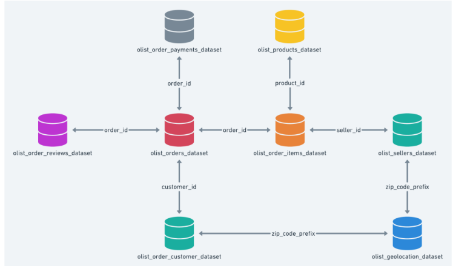

# Olist Data Analysis Project: Unlocking Customer Insights with SQL
## Project Overview
Dự án này giới thiệu nỗ lực phân tích dữ liệu thực tế bằng cách sử dụng tập dữ liệu thương mại điện tử Olist, một trong những thị trường trực tuyến lớn nhất của Brazil. Tận dụng SQL, tôi đã tiến hành Phân tích dữ liệu thăm dò (EDA) chuyên sâu để phân khúc khách hàng thành các nhóm chính—Khách hàng tốt nhất, Khách hàng đã ngừng sử dụng và Khách hàng tiềm năng đã ngừng sử dụng—bằng cách sử dụng mô hình RFM (Gần đây, Tần suất, Tiền tệ). Ngoài ra, tôi đã giải quyết các câu hỏi kinh doanh quan trọng, bao gồm xu hướng doanh thu, danh mục sản phẩm phổ biến và các biến thể Giá trị đơn hàng trung bình (AOV), cung cấp thông tin chi tiết có thể hành động để tối ưu hóa nền tảng của Olist. DDự án này làm nổi bật khả năng làm sạch dữ liệu, thực hiện phân tích nâng cao và cung cấp các giải pháp hướng đến doanh nghiệp của tôi, khiến nó trở thành một minh chứng có giá trị về các kỹ năng Phân tích dữ liệu của tôi kể từ tháng 6 năm 2025.
## Objective
1. Làm sạch và xử lý dữ liệu để đảm bảo độ chính xác và độ tin cậy trong phân tích.
2. Thực hiện phân tích khám phá dữ liệu (EDA) để hiểu hành vi khách hàng và các mô hình giao dịch.
3. Phân nhóm khách hàng thành các nhóm có ý nghĩa (ví dụ: Khách hàng tốt nhất, Khách hàng đã rời bỏ, Khách hàng có nguy cơ rời bỏ) bằng cách sử dụng mô hình RFM (Tái ghé thăm gần đây, Tần suất mua hàng, Giá trị chi tiêu).
4. Phân tích các chỉ số kinh doanh quan trọng như tổng doanh thu, xu hướng số lượng đơn hàng, các danh mục sản phẩm phổ biến và Giá trị Đơn hàng Trung bình (AOV) theo từng phân khúc.
5. Cung cấp các thông tin chuyên sâu có thể hành động để tối ưu hóa nền tảng thương mại điện tử Olist và hỗ trợ việc ra quyết định chiến lược.
## Project Structure
Dự án được xây dựng dựa trên bộ dữ liệu thương mại điện tử Olist, với các mối quan hệ giữa các bảng được minh họa trong sơ đồ thực thể - quan hệ (Entity-Relationship Diagram - ERD) bên dưới


## SQL Code for Table Creation
```sql
-- Create Customers table
CREATE TABLE Customers (
    customer_id VARCHAR(50) PRIMARY KEY,
    customer_unique_id VARCHAR(50),
    customer_zip_code_prefix VARCHAR(5),
    customer_city VARCHAR(100),
    customer_state CHAR(2)
);
-- Create Geolocation table
CREATE TABLE Geolocation (
    geolocation_zip_code_prefix VARCHAR(5),
    geolocation_city VARCHAR(100),
    geolocation_state CHAR(2)
);
-- Create Order_Items table
CREATE TABLE Order_Items (
    order_id VARCHAR(50),
    order_item_id INT,
    product_id VARCHAR(50),
    seller_id VARCHAR(50),
    shipping_limit_date DATETIME,
    price DECIMAL(10, 2),
    freight_value DECIMAL(10, 2)
);
-- Create Order_Payments table
CREATE TABLE Order_Payments (
    order_id VARCHAR(50),
    payment_sequential INT,
    payment_type VARCHAR(50),
    payment_installments INT,
    payment_value DECIMAL(10, 2)
);
-- Create Order_Reviews table
CREATE TABLE Order_Reviews (
    review_id VARCHAR(50) PRIMARY KEY,
    order_id VARCHAR(50),
    review_score INT,
    review_comment_title VARCHAR(200),
    review_comment_message TEXT,
    review_creation_date DATETIME,
    review_answer_timestamp DATETIME
);
-- Create Sellers table
CREATE TABLE Sellers (
    seller_id VARCHAR(50) PRIMARY KEY,
    seller_zip_code_prefix VARCHAR(5),
    seller_city VARCHAR(100),
    seller_state CHAR(2)
);
-- Create Orders table
CREATE TABLE Orders (
    order_id VARCHAR(50) PRIMARY KEY,
    customer_id VARCHAR(50),
    order_status VARCHAR(50),
    order_purchase_timestamp DATETIME,
    order_approved_at DATETIME,
    order_delivered_carrier_date DATETIME,
    order_delivered_customer_date DATETIME,
    order_estimated_delivery_date DATETIME
);
-- Create Products table
CREATE TABLE Products (
    product_id VARCHAR(50) PRIMARY KEY,
    product_category_name VARCHAR(100),
    product_name_length INT,
    product_description_length INT,
    product_photos_qty INT,
    product_weight_g DECIMAL(10, 2),
    product_length_cm DECIMAL(10, 2),
    product_height_cm DECIMAL(10, 2),
    product_width_cm DECIMAL(10, 2)
);
```
## Data Analysis & Findings

Phần này trình bày quy trình phân tích dữ liệu và các phát hiện chính dựa trên bộ dữ liệu Olist, thực hiện theo các bước được nêu trong các đoạn mã SQL.

### 1. Data Cleaning

Mục tiêu: Đảm bảo chất lượng dữ liệu bằng cách xử lý giá trị NULL, dữ liệu trùng lặp, không đồng nhất kiểu dữ liệu và các giá trị ngoại lai

**Process**

***+Kiểm tra giá trị NULL ở các cột quan trọng (ví dụ: bảng order_reviews) bằng cách so sánh COUNT(*) và COUNT(column)***

```sql
SELECT
    COUNT(*) AS total_rows,
    COUNT(*) - COUNT(review_id) AS null_review_id,
    COUNT(*) - COUNT(order_id) AS null_order_id,
    COUNT(*) - COUNT(review_score) AS null_review_score,
    COUNT(*) - COUNT(review_comment_title) AS null_comment_title,
    COUNT(*) - COUNT(review_comment_message) AS null_comment_message,
    COUNT(*) - COUNT(review_creation_date) AS null_creation_date,
    COUNT(*) - COUNT(review_answer_timestamp) AS null_answer_timestamp
FROM order_reviews;
```
***+Kiểm tra giá trị trùng lặp ví dụ đối với bảng Customer thì cột customer_id không nên trùng lặp, hay product_id trong bảng Product***

```sql
SELECT customer_id, COUNT(*) as count 
FROM customers
GROUP BY customer_id
HAVINGHAVING count(*) > 1
```
***+Chuẩn hóa kiểu dữ liệu trong cột để hỗ trợ phân tích theo thời gian***

```sql
-- Kiểm tra định dạng hiện tại 
SELECT 
    COLUMN_NAME,
    DATA_TYPE
FROM INFORMATION_SCHEMA.COLUMNS
WHERE TABLE_NAME = 'Orders'

-- tiến hành thay đổi, bằng cách thêm cột tạm cho order_purchase_timestamp

ALTER TABLE orders
ADD order_purchase_timestamp_temp DATETIME;

-- Chuyển dữ liệu từ NVARCHAR sang DATETIME

UPDATE orders
SET order_purchase_timestamp_temp = CONVERT(DATETIME, order_purchase_timestamp, 120)
WHERE ISDATE(order_purchase_timestamp) = 1;

-- Xóa cột cũ
ALTER TABLE orders
DROP COLUMN order_purchase_timestamp;

-- Đổi tên cột tạm thành cột gốc
EXEC sp_rename 'orders.order_purchase_timestamp_temp', 'order_purchase_timestamp', 'COLUMN';
```
***Xử lí giá trị ngoại lại bằng phương pháp IQR***

```sql
WITH stats AS (
    SELECT 
        PERCENTILE_CONT(0.25) WITHIN GROUP (ORDER BY price) over() AS Q1,
        PERCENTILE_CONT(0.75) WITHIN GROUP (ORDER BY price) over() AS Q3
    FROM order_items
)
SELECT 
    order_id, 
    price
FROM order_items, stats
WHERE price < (Q1 - 1.5 * (Q3 - Q1))
   OR price > (Q3 + 1.5 * (Q3 - Q1))
=>> Kết luận: Dữ liệu đã được làm sạch thành công, không có trùng lặp hoặc ngoại lệ nghiêm trọng, đảm bảo tính tin cậy cho phân tích.
```
### 2. Customer Segmentation using RFM Analysis
Mục tiêu: Phân loại khách hàng thành các nhóm Khách hàng Tốt nhất, Đã rời bỏ, và Có nguy cơ rời bỏ dựa theo mô hình RFM
**Process**

+ Recency (R - Gần đây): Tính số ngày kể từ lần mua cuối cùng so với ngày đặt hàng gần nhất.
+ Frequency (F - Tần suất): Đếm số đơn hàng duy nhất theo từng khách hàng.
+ Monetary (M - Chi tiêu): Tính tổng chi tiêu (giá + phí vận chuyển) của từng khách hàng.
=> Phân loại theo thang điểm 1–5 cho từng chỉ số và kết hợp để xác định phân khúc

```sql
WITH table_1 AS (
SELECT c.customer_id as Mã_Khách_Hàng_R, o.order_purchase_timestamp as Ngày_mua_hàng, 
    (SELECT MAX(order_purchase_timestamp)
     FROM orders ) AS Ngày_làm_mốc 
FROM orders AS o
JOIN customers AS c
ON o.customer_id=c.customer_id
), table_2 AS (
SELECT *, DATEDIFF(day,Ngày_mua_hàng, Ngày_làm_mốc) AS Khoảng_cách 
FROM table_1
), table_3 AS (
-- Phân nhóm khách hàng, tiêu chí chia nhóm khách hàng thành 5 nhóm bằng nhau và đánh giá 
SELECT * , NTILE(5) OVER (ORDER BY Khoảng_cách ASC) AS Phân_loại_R
FROM table_2 
), table_4 AS (
--- Tính chỉ số Frequency: Đếm số lượng đơn hàng duy nhất mà mỗi khách hàng đã đặt
SELECT c.customer_id AS Mã_Hàng_Hàng_F, COUNT(DISTINCT order_id) AS Số_lương_đơn_hàng
FROM orders AS o
JOIN customers AS c
ON o.customer_id=c.customer_id
GROUP BY c.customer_id
), table_5 AS (
SELECT *, NTILE(5) OVER (ORDER BY Số_lương_đơn_hàng DESC ) AS Phân_loại_F
FROM table_4
), table_6  (
--- Tính chỉ số Monetary: Tính tổng giá trị tiền mà mỗi khách hàng đã chi tiêu
SELECT c.customer_id AS Mã_Hàng_Hàng_M, oi.price, oi.freight_value, oi.price + oi.freight_value AS Tổng_số_tiền
FROM orders AS o
JOIN customers AS c
ON o.customer_id=c.customer_id
JOIN Order_items AS oi
ON o.order_id=oi.order_id
), table_7 AS (
SELECT *, NTILE(5) OVER (ORDER BY Tổng_số_tiền DESC) AS Phân_loại_M
FROM table_6
), table_8 AS (
--- Hợp nhất 3 bảng lại với cột Customer_id chung
SELECT table_3.Mã_Khách_Hàng_R, Phân_loại_R AS Điểm_số_R , Phân_loại_M AS Điểm_số_M, Phân_loại_F AS Điểm_số_F
FROM table_3
JOIN table_5
ON table_3.Mã_Khách_Hàng_R=table_5.Mã_Hàng_Hàng_F
JOIN table_7
ON table_3.Mã_Khách_Hàng_R=table_7.Mã_Hàng_Hàng_M
), table_9 AS (
-- Lọc khách hàng Best Customer : tiêu chí R = 1 ( Mua gần đây), F = 5 (Số đơn nhiều ), M (tiền chi nhiều)
SELECT *
FROM table_8
WHERE Điểm_số_R = 1 and Điểm_số_M = 5 and Điểm_số_F = 5 
), table_10 AS (-- Lấy thông tin khách hàng best customer 
SELECT DISTINCT table_9.Mã_Khách_Hàng_R,c.customer_city, c.customer_state, Order_items.price, Order_items.freight_value, 
Order_payments.payment_type,products.product_category_name
FROM table_9 
JOIN customers as c
ON table_9.Mã_Khách_Hàng_R= c.customer_id
JOIN Orders 
ON orders.customer_id=c.customer_id
JOIN Order_items
ON orders.order_id=Order_items.order_id
JOIN Order_payments
ON Order_payments.order_id=Orders.order_id
JOIN products
ON products.product_id=Order_items.product_id
```
### 3. Business Questions & Insights

***3.1. Tổng Doanh Thu và Xu Hướng***

Mục tiêu: Tính tổng doanh thu mà Olist tạo ra và phân tích sự thay đổi của doanh thu theo thời gian

Quy trình: Tổng hợp doanh thu (giá + phí vận chuyển) theo ngày, tháng và năm bằng cách sử dụng GROUP BY trên order_purchase_timestamp trong SQL.

```sql
-- Doanh thu theo Ngày 
SELECT FORMAT(CONVERT(DATETIME, orders.order_purchase_timestamp), 'dd - MM - yyyy') AS Ngày, sum(Price + freight_value) AS Doanh_thu_theo_ngày
FROM Order_items 
JOIN Orders
ON Orders.order_id= Order_items.order_id
GROUP BY FORMAT(CONVERT(DATETIME, orders.order_purchase_timestamp), 'dd - MM - yyyy')
ORDER BY FORMAT(CONVERT(DATETIME, orders.order_purchase_timestamp), 'dd - MM - yyyy') ASC

-- Doanh thu theo Tháng
SELECT FORMAT(CONVERT(DATETIME, orders.order_purchase_timestamp), 'MM - yyyy') AS Tháng, sum(Price + freight_value) AS Doanh_thu_theo_ngày
FROM Order_items 
JOIN Orders
ON Orders.order_id= Order_items.order_id
GROUP BY FORMAT(CONVERT(DATETIME, orders.order_purchase_timestamp), 'MM - yyyy')
ORDER BY FORMAT(CONVERT(DATETIME, orders.order_purchase_timestamp), 'MM - yyyy') ASC

-- Doanh thu theo năm 
SELECT FORMAT(CONVERT(DATETIME, orders.order_purchase_timestamp), 'yyyy') AS Tháng, sum(Price + freight_value) AS Doanh_thu_theo_ngày
FROM Order_items 
JOIN Orders
ON Orders.order_id= Order_items.order_id
GROUP BY FORMAT(CONVERT(DATETIME, orders.order_purchase_timestamp), 'yyyy')
ORDER BY FORMAT(CONVERT(DATETIME, orders.order_purchase_timestamp), 'yyyy') ASC
```
***3.2. Xu Hướng Số Lượng Đơn Hàng***

Mục tiêu: Xác định số lượng đơn hàng và sự thay đổi của chúng theo thời gian

Quy trình: Đếm số đơn hàng duy nhất theo tháng bằng COUNT(DISTINCT order_id) và GROUP BY order_purchase_timestamp

```sql
-- Số lượng đơn hàng theo tháng
SELECT FORMAT(CONVERT(DATETIME, orders.order_purchase_timestamp), 'MM - yyyy') AS Tháng, count(order_id) AS Tổng_đơn_hàng
FROM Order_items 
GROUP BY FORMAT(CONVERT(DATETIME, orders.order_purchase_timestamp), 'MM - yyyy')
ORDER BY FORMAT(CONVERT(DATETIME, orders.order_purchase_timestamp), 'MM - yyyy') ASC
```

***3.3. Các Danh Mục Sản Phẩm Phổ Biến***

Mục tiêu: Xác định các danh mục sản phẩm phổ biến nhất và so sánh hiệu quả doanh số của chúng.

Quy trình: Phân tích số lượng đơn hàng và tổng doanh thu theo product_category_name bằng GROUP BY và ORDER BY

```sql
SELECT p.product_category_name AS Danh_mục, count(order_id) AS Số_lượng, sum(price+ freight_value) AS TỔng_doanh_số
FROM Order_items AS Oi
JOIN Products AS p
ON Oi.product_id=p.product_id
GROUP BY p.product_category_name 
ORDER BY count(order_id) DESC    
```

***3.4. Phân Tích Giá Trị Đơn Hàng Trung Bình (AOV)***

Mục tiêu: Đánh giá AOV và sự khác biệt của nó giữa các danh mục sản phẩm và phương thức thanh toán.

Quy trình: Tính AOV bằng trung bình của price + freight_value, nhóm theo product_category_name và payment_type

```sql
-- Giá trị AVO theo Product Category 
SELECT 
    p.product_category_name AS Danh_mục,
    AVG(subquery.order_total) AS AVO_theo_danh_mục
FROM (
    SELECT 
        oi.order_id,
        SUM(oi.price + oi.freight_value) AS order_total
    FROM Order_items AS oi
    JOIN Products AS p ON oi.product_id = p.product_id
    GROUP BY oi.order_id
) AS subquery
JOIN Products AS p ON subquery.order_id IN (
    SELECT order_id 
    FROM Order_items 
    WHERE product_id = p.product_id
)
GROUP BY p.product_category_name
ORDER BY AVO_theo_danh_mục DESC;
-- Giá trị AVO trên Payment_method 
SELECT 
    pay.payment_type AS Phương_thức,
    AVG(subquery.order_total) AS AVO_theo_phương_thức
FROM (
    SELECT 
        oi.order_id,
        SUM(oi.price + oi.freight_value) AS order_total
    FROM Order_items AS oi
    GROUP BY oi.order_id
) AS subquery
JOIN Order_payments AS pay
    ON subquery.order_id = pay.order_id
GROUP BY pay.payment_type
ORDER BY AVO_theo_phương_thức DESC;
```


